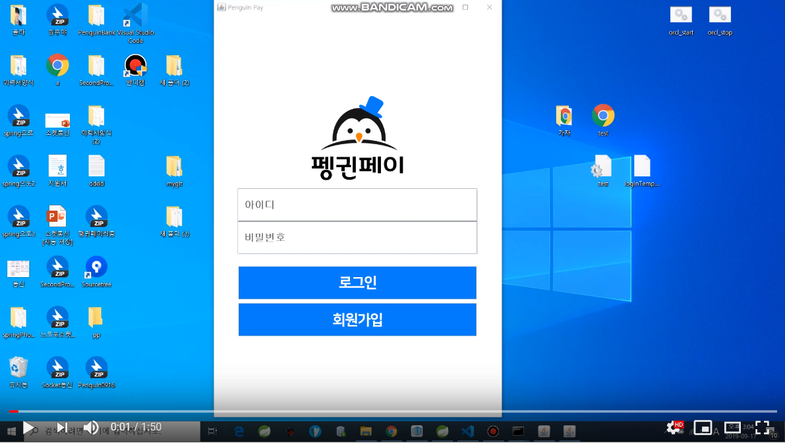

# Vsearch
——————
## 1. 목차
```
.Vsearch
├── 1.목차
├── 2.개요
├── 3.사용법
|   ├── 3.1.환경 세팅
|   └── 3.2.실행 방법
├── 4.실행 영상
|   ├── 4.1.실행 영상
└── …
```


## 2. 개요
 - 은행 앱으로서 사용자는 송금 및 조회 업무를 볼수 있게 하였습니다.

## 3. 사용법
### 3.1. 환경 세팅
- OS : Windows 10
- DB : Oracle 11g
- Language : Java
### 3.2. 실행 방법
```
1. DBUtil.java에서 url필드를 환경에 맞게 수정합니다.
2. DDL폴더에 있는 text파일로 된 쿼리문장을 실행 후 커밋합니다.
3. Controller.java의 생성자에서 ip주소를 현재 로컬 ip주소로 수정합니다.
3.Server.java를 실행시킵니다.
4.Conroller.java를 실행시킵니다.
```


## 4. 실행 영상
### 4.1. 실행 영상
 [](https://www.youtube.com/watch?v=DOAdU89H_Y8&feature=youtu.be)
 
